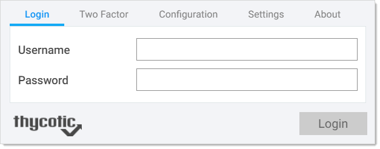
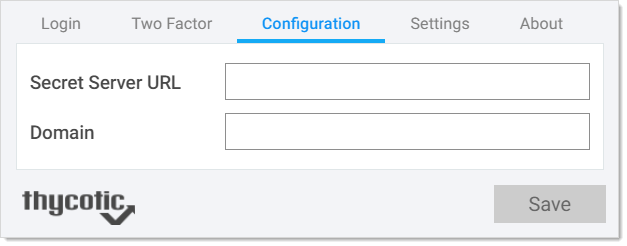

[title]: # (Connecting with Secret Server)
[tags]: # (WPF)
[priority]: # (20)

# Connecting with Secret Server

After installation, you must configure WPF to connect with SS before logging on the Website. You can use the Configuration tab on the WPF to configure it with the SS instance of your choice.

To connect WPF with SS:

1. Open Google Chrome or other supported browser.

1. On the upper-right of the browser, click the **Password Filler**  icon. The WPF login window appears:

   

1. Click the **Configuration** tab:

     

1. In the **Secret Server URL** text box, type your SS URL. For example: `https://myserver/secretserver/`

1. In the **Domain** text box, type the domain of Secret Server. This only applies if you set up SS to use a domain.

1. Click the **Save** button. A confirmation message appears. WPF’s connection settings are now saved.
