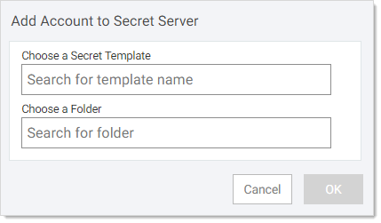
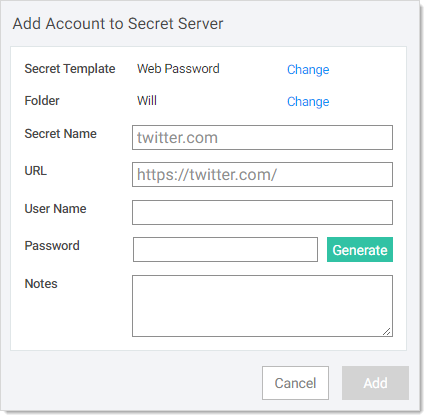

[title]: # (Creating a Secret for a Website)
[tags]: # (WPF)
[priority]: # (30)

# Creating a Secret for a Website

1. Navigate to the "create a new account” form on the website you want to create a secret for.

1. Click the Thycotic icon in the password text box. A popup appears:

   

   > **Note:** You can also select the username or password text boxes and right-click and go to Password Filler \> Add Secret.

1. Click the **Add Secret** button. The Add Account to Secret Server popup appears:

   

1. Begin typing “web” in the **Choose a Secret Template** search box. The word Web Password will appear in a dropdown list. By default, WPF tries to add the standard Web Password template for you. You can instead search for a different template.

1. Click the **Web Password** suggestion. The search box is populated with it.

1. Type the name of the SS folder you want the secret to reside. If you did not already set one up, by default, SS creates a folder titled with your SS username. Click to select the desired folder in the dropdown that appears. By default, WPF tries to select the personal folder for the username that you are logged in under. If one does not exist, you will need to specify which folder to save it to.

1. Click the **OK** button. Another Add Account to Secret Server popup appears:

   

   SS fills in some of the text boxes for you based on the current website.

   > **Important:** If you are setting up a secret for Microsoft Online, leave the popup as is (do not close it) and read [Using WPF with Microsoft Online Services](#Using-WPF-with-Microsoft-Online-Services) before continuing.

1. The **Secret Name** text box was inferred by WPF—leave it as is or change it to whatever you like.

1. Type your username for the website in the **User Name** text box.

1. If this is a new account, click the **Generate** button to create a strong password for the password for the site. Otherwise, use the existing password for the website.

1. Click the **Add** button. WPF will populate the "new account” form with what you type and the new password. The Add Account Secret Server popup disappears. A secret is now available for the password and name on the website’s main log on page.

   > **Note:** Not all websites work with WPF populating the "new account” form for you. There are ways around that, including creating the website account first, independent of WPF, and using the password you assigned it, rather than our generated one, to complete the Password text box. Please contact Thycotic Support for details.
