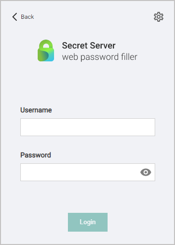
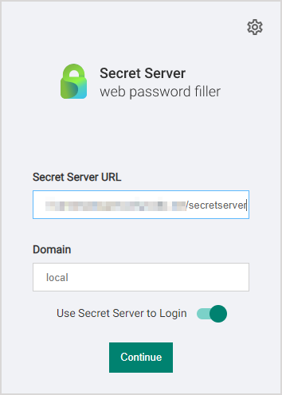

[title]: # (Connecting with Secret Server)
[tags]: # (WPF)
[priority]: # (4)
# Connecting with Secret Server

After installation, you must configure WPF to connect with Secret Server before logging on the Website. You can use the Configuration tab on WPF to configure it with the Secret Server instance of your choice.

To connect WPF with Secret Server:

1. Open Google Chrome or any other supported browser.
1. In the upper-right corner of the browser, click the __Password Filler__  icon. The WPF login window appears:

   

1. Click __Back__ in the upper left corner.

   

1. In the __Secret Server URL__ field, type your Secret Server URL. For example: `https://myserver/secretserver/`
1. In the __Domain__ field, type the domain of Secret Server. This only applies if you set up Secret Server to use a domain otherwise it is Local by default. This should match the options configured in Secret Server for this sign in page:

   

1. Click the __Login__ button.
