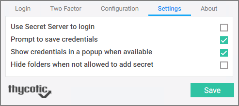
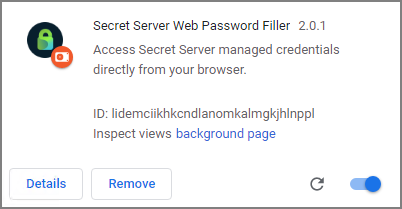

[title]: # (Getting Started)
[tags]: # (WPF)
[priority]: # (11)
# Terminology

To help eliminate any potential confusion for terminology for the different
browser add-ons, this section will review what terms were being used for each
add-on and provide some visual points.

## Secret Server Web Password Filler

This is the new Web Password Filler browser extension that was release with Secret Server version 10.7.59 and later. Typically, this will be referred to as:

* WPF
* Web Password Filler
* Password Filler

When looking in a browser this is represented by the following:

| State | Location/Browser | Example |
| ----- | ----- | ----- |
| Logged Out | (In top right corner) |  |
| Logged In  | (In top right corner) |  |
| Application in Browser | |  |
| Item on Extensions / Add-On page | Chrome |  |
|  | Firefox  |  |
|  | Edge (chromium version) |  |
|  | Opera |  |

## Secret Server Login Assist

This is the previous version of the Web Password Filler/Login assist extension.
It is typically referred to as:

* WPF (Term No longer used in relation to this extension)
* Web Password Filler (Term No longer used in relation to this extension)
* Login Assist (Still used)

When looking in a browser this is represented by the following:

| Location | Example |
| ----- | ----- |
| Logo in top right corner |  |
| Application in Browser |  |
| Drop down option on field  |  |
| Item on Extensions / Add-On page |  |

## Secret Server Clipboard Utility

This is the Clipboard Utility that was available with previous versions of
Secret Server. The options and functionality of this extension have NOT be added
into the NEW Web Password Filler (as of Feb 28, 2020).

It is typically referred to as:

* Clipboard Utility (Still used)
* Clipboard tool (Still used)

When looking in a browser this is represented by the following:

| Location | Example |
| ----- | ----- |
| Logo in top right corner |  |
| or |  |
| Application in Browser |  |
| Item on Extensions / Add-On page |  |
