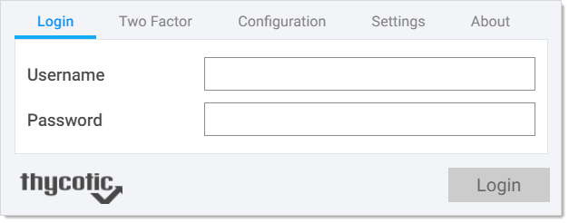

[title]: # (Login to Secret Server)
[tags]: # (WPF)
[priority]: # (5)
# Login to Secret Server

Before you have access to any secrets that apply to your websites, you must first log in and connect WPF to Secret Server. There are two ways to do this. The first is by entering your credentials into WPF and having it verify back with Secret Server. The second is by redirecting the login (through a new browser tab) back to Secret Server and using the Secret Server Web login to make the connection.

The examples below use Google Chrome and Duo. However other browsers and two-factor authentication applications are supported. Refer to information about [supported extensions](install.md) and Secret Server's list of two-factor applications that are supported.

## Manually Logging into Secret Server with WPF

To use the __Password Filler__ icon of WPF to log on Secret Server:

>**Note**: Before logging in, ensure that WPF is configured with Secret Server. If you do not have the Secret Server instance in the Configuration tab, WPF prompts you to enter it and switches to that tab before trying to log on. This ensures you know what you are logging into.

1. Open, for example, __Google Chrome__.
1. In the upper-right corner of the browser, click the __Password Filler__  icon. The WPF login window appears:

   
1. For __Username__, type the username you use to access Secret Server. This is your Secret Server user name and not your email address.
1. For __Password__, enter the password for your account.

   >**Note**: These are the same credentials you use for logging on Secret Server.
1. Click the __Login__ button. If you do not have two-factor authentication enabled in Secret Server, you are now logged in.
1. If you have two-factor authentication enabled in Secret Server (and your login was authenticated), you are sent to the __Two Factor__ tab to complete the second authentication:

   
1. Depending on how Secret Server is configured, do one of the following:

   - Click, for example, __Push Duo__ to authenticate with your Duo app.
   - Click __Phone__ to receive an authentication text message with a PIN code. Enter that code in the __Pin Code__ field.
1. Click __Login__. You are now logged in to Secret Server, and the WPF icon changes to

## Logging into Secret Server via the WPF Secret Server Button

The __Login with Secret Server__ button allows you to log in to WPF using a redirect through the Secret Server log in, also known as SAML or single sign on. This replaces the User Name and Password text boxes on the Login tab in WPF.

<!-- TODO >__Note:__ If this is your first time using it, see [Enabling the Secret Server Button in WPF](#Enabling-the-Secret-Server-Button-in-WPF) first. -->

1. Open, for example, __Google Chrome__.
1. In the upper-right corner of the browser, click the __Password Filler__  icon. The WPF login window appears:

   

   If you already have enabled the __Use Secret Server to login__ option on the Settings tab, then the Login tab will show the __Login with Secret Server__ button.
1. Click the __Login with Secret Server__ button. WPF opens a new tab for Secret Server in the browser, where you can log on.

   >**Note**: After logging in to Secret Server, or if you were recently logged in, the __Generate token__ page should appear in your browser. Click __Generate Token__.
   >
   >
   >You will then be logged on, and the browser tab with Secret Server will automatically close.
 
<!-- 1. If you have two-factor authentication enabled in Secret Server (and your log on was authenticated), you are sent to the __Two Factor__ tab to complete the second authentication:

   
1. Depending on how Secret Server is configured, do one of the following:

   - Click, for example, __Push Duo__ to authenticate with your Duo app.
   - Click __Phone__ to receive an authentication text message with a PIN code. Enter that code in the __Pin Code__ field.
1. Click __Login__. You are now logged in to Secret Server, and the WPF icon changes to-->
