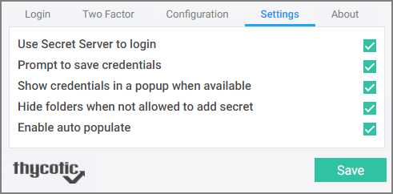
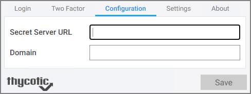
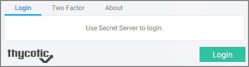

[title]: # (Native Messaging Host)
[tags]: # (WPF)
[priority]: # (15)

# Native Messaging Host

The Thycotic Native Messaging Host is installed on a user’s computer and consists of one executable file and one configuration file. Each time a user’s browser is launched, the Native Messaging Host silently sends default configurations and settings to the Web Password Filler.

Before the Web Password Filler attempts to retrieve any secrets associated with a URL, an exclusion list can prevent the Web Password Filler from retrieving, populating, or saving Secrets unless a specified page is active.


## Does the Web Password Filler Require the Thycotic Native Message Host?

No, the Web Password Filler can still run normally without the Native Message Host, however the end user will be required to supply the Secret Server URL and modify any settings to meet their needs. To use an exclusion list with Web Password Filler, the Native Message Host is required.

## Installing the Thycotic Native Message Host

### Download Location

Download the Native Message Host installer [here](https://thy.center/wpf/link/MessingHostInstaller).

### Requirements

* .NET version 4.5.2
* Thycotic Web Password Filler version 2.0.3 and later

### Supported Browsers

* Chrome
* FireFox
* Edge Chromium
* Opera

Additional information regarding Native Messaging can be found at

* https://developer.chrome.com/extensions/nativeMessaging
* https://developer.mozilla.org/en-US/docs/Mozilla/Add-ons/WebExtensions/Native_messaging

### Installation

To install the Thycotic Native Message Handler on a user’s computer, copy the ThycoticMessagingHost.exe and a _settings.json_ file into a directory that is accessible (read access) to the end user, e.g. `C:\Thycotic\Web Password Filler\`.

Once the ThycoticMessagingHost.exe and a _settings.json_ file are copied to the user’s machine, you must register the ThycoticMessagingHost.exe with the browsers. To do this run ThycoticMessagingHost.exe with a `--register` command line option. This MUST be called before the Native Messaging handler will
interact with the Thycotic Web Password Filler. Example, (from a command window `C:\Thycotic\Web Password Filler\ThycoticMessagingHost.exe --register`.

>**Note** Once you have successfully registered the Thycotic Messaging Host, the configuration file will be checked for updates automatically each time your browser launches. You do not have to unregister and re-register each time you make a change to the configuration file. 

If you manually add the extension to the browser instead of getting it from the browser store, the extension ID changes. In that case, you __MUST__ update the _settings.json_ to reflect the new extension ID. Whenever you change the extension ID, you must run the `-–register` command line option again before the extension will be able to communicate to the native messaging host. Refer to the _settings.json_ example at the end of this topic.

Changing other options or settings in the _settings.json_ will automatically be reflected once the user launches their browser.

During the registration process, the Thycotic Native Message Handler will create three folders (Chrome, Edge, Firefox) which contain the “native messaging host configuration” information required by the browsers. Additionally, register entries are created for each browser in either the current user registry or the
local machine registry.

For example, `HKEY_CURRENT_USER\Software\Google\Chrome\NativeMessagingHosts\com.thycotic.wpf.host` with a default value that is the path to the “native messaging host configuration” file. If registering using the `EnableForAllUsers = true` option, you must run the registration as an administrator.

### Uninstalling the Thycotic Native Message Handler

To disable or remove the Thycotic Native Message Handler, use the `–unregister` option, for example `C:\Program Files\Thycotic\Web Password Filler\ThycoticMessagingHost.exe --unregister`. Once unregistered, the Thycotic Native Message Handler can no longer communicate with the Thycotic Web Password Filler.

## Configuration Options

The settings can be managed through the Thycotic Native Message handler by modifying and deploying a _settings.json_ file. The file is read by the Thycotic Native Message Handler and on request from the Thycotic Web Password Filler, passes the information to the Thycotic Web Password Filler. Once the Thycotic
Web Password Filler has the information, the Thycotic Web Password Filler updates the local storage with the new settings and configuration.

>**Note**: Aside from being able to manage the Thycotic Web Password Filler settings, the Thycotic Native Message handler provides a more robust method of storing the settings that are not impacted when the browser cache is deleted.

### Settings.json Format

The _settings.json_ is a json file. There are many online validators to ensure that the json is formatted correctly and we recommend that you validate your json prior to deployment.

Here is an example _settings.json_ file that sets the Secret Server URL to `<https://SomeURL/SecretServer>`, the domain to “local” and enables all available options that are provided with the Thycotic Web Password Filler as well as hides the configuration and settings pages from the end users.

```json
{

  "chromeExtensionId": "mfpddejbpnbjkjoaicfedaljnfeollkh",
  "edgeExtensionId": "kjldmpkefedgljefehmmfifbhnjngmbh",
  "operaExtensionId": "beepinocelldcfagolbdjnmoecmbojkn",
  "firefoxExtensionId": "dd1e31d5-3623-45cb-b1ad-64074d36b360@thycotic.com",
  "ConfigSSUrl": "https://SomeURL/SecretServer",
  "ConfigDomain": "local",
  "HideConfigPage": false,
  "HideSettingPage": false,
  "SettingUserSSLogin": false,
  "SettingPrompToSave": true,
  "SettingShowPopup": true,
  "SettingHideReadOnlyFolders": false,
  "SettingEnableAutoPopulate": true,
  "EnableForAllUsers": true,
"Exclude": [
     "http://*",
     "http://endoftheinternet.com",
     "https://www.MyCompanySite.com",
     "https://live.com/"
    ],
  "ExcludeException": [
     "https:// MyCompanySite.com/Login.html",
     "https://login.live.com/login.srf"
    ]
}
```

__Where__:

| Parameter | Default | Description |
| ----- | ----- | ----- |
| chromeExtensionID | "mfpddejbpnbjkjoaicfedaljnfeollkh" | This is the ID required for the Chrome browser registration. |
| edgeExtensionId | "kjldmpkefedgljefehmmfifbhnjngmbh" | This is the ID required for the Edge browser registration. |
| operaExtensionId | "beepinocelldcfagolbdjnmoecmbojkn" | This is the ID required for the Opera browser registration. |
| firefoxExtensionId | "dd1e31d5-3623-45cb-b1ad-64074d36b360@thycotic.com" | This is the ID required for the Firefox browser registration. |
| ConfigSSUrl | "https://SomeURL/SecretServer" | This is the URL for your Secret Server instance. |
| ConfigDomain | "local" | This is the domain identification either local or your corporate network domain. |
| HideConfigPage | false | Boolean that controls if the Configuration tab is visible or not. |
| HideSettingPage | false | Boolean that controls if the Settings tab is visible or not. |
| SettingUserSSLogin | false | Boolean that sets the checkbox to enable the Secret Server Login option. |
| SettingPrompToSave | true | Boolean that sets the checkbox to enable the Prompt to Save option. |
| SettingHideReadOnlyFolders | false | Boolean that sets the checkbox to enable the Hide Read Only Folder option. |
| SettingEnableAutoPopulate | true | Boolean that sets the checkbox to enable the Auto Populate option for secrets and passwords. |
| EnableForAllUsers | true | Boolean specifying if the Native Message Handler is available under the local user context only or made available for all users. If set to true, it allows all users on the machine to access the settings.json file as long as it's in a shared location. If set to "false" it only applies to the current logged in user no matter where the file is stored. Changes impacting the registry keys also require admin permissions if EnableForAllUsers is set to true. |
| Exclude | [list] | Refer to [Site Exclusions and Exceptions](#site_exclusions_and_exceptions) below. Accepts wildcards. |
| ExcludeException | [list] | Refer to [Site Exclusions and Exceptions](#site_exclusions_and_exceptions) below. Does NOT accept wildcards. |

### Site Exclusions and Exceptions

The Thycotic Web Password Filler is an “inclusive” extension. Any website that contains a username and password has the potential to have a secret retrieved from or stored in Secret Server. However, some sites are simple web forms that contain user name, password and a variety of other field types. Registration forms for instance would not require interaction or population of the username and password from the Thycotic Web Password Filler. The Thycotic Native Message handler allows you to add exclusions as well as exclusion exceptions so those sites you do not want the Thycotic Web Password Filler to interact with will be ignored. Add exceptions for any site you wish the Thycotic Web Password Filler to ignore. For example, to login to an application you want the Thycotic Web Password Filler to retrieve a secret for the login page, however you would like the Web Password filler to ignore every other page for that same site, add the specific page URL to the exclusion exception list.

To exclude all sites, a wild card can be used (`https://*` and/or `http://*`) and then simply add the sites where secrets are available (<https://MyCompanySite.com/login.aspx>) to the exclusion exception list.

>**Note**: Only the “Exclude” section accepts a wild card. The “ExcludeException” must be the exact URL without a query string.

### UI Behavior Based on Settings

Each setting on the settings page can be set using “true” or “false” in the _settings.json_.



The Secret Server URL and Domain can be set by including strings (text wrapped up in quotations).



Additionally, you can choose to hide these pages from the end user so that the settings and configuration options cannot be changed.



### Error Messages

* The following error message indicates that there are missing elements in the settings.json. 

   ```bash
   There are elements missing from settings.json. Review the documentation and update setting.json with the missing attributes.
   ```

   Review the _settings.json_ format and ensure all elements are provided and the json is well formatted.
* The following message indicates that the setting “EnableForAllUsers” is set to true; however, the user attempting to register the Thycotic Native Messaging Handler does not have administrator permissions and cannot update or create the hkey local machine registry key required for browser registration.

   ```bash
   This application must be run as an administrator when registering for All Users
   ```

* The following error message indicates that he ThycoticMessagingHost.exe was executed without the required command line option.

   ```bash
   To register the native messaging host, run cmd.exe ThycoticMessagingHost.exe –register
   To unregister the native messaging host, run cmd.exe ThycoticMessagingHost.exe --unregister
   Press any key to exit
   ```

* The following message indicates that only `-–register` and `-–unregister` are valid command line options.

   ```bash
   Incorrect command line. Review the documentation to register or unregister this application.
   ```
