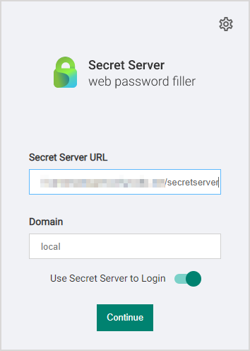

[title]: # (Native Messaging Host)
[tags]: # (WPF)
[priority]: # (15)

# Native Messaging Host

The Thycotic Native Messaging Host makes it easier to manage settings for the Thycotic Web Password Filler (WPF). it also provides a more robust method of storing the settings so they are not impacted when the browser cache is deleted.

Without the Native Messaging Host, the Web Password Filler runs normally, but the end user will be required to supply the Secret Server URL and to modify other settings to meet their needs.

Native Messaging Host consists of one executable file and one configuration file installed on the user’s computer. Each time the user’s browser is launched, the Native Messaging Host silently sends default configurations and settings to the Web Password Filler.

Users can prevent Web Password Filler from functioning on specific URLs by adding those URLs to an exclusion list. Web Password Filler will not access Secrets for URLs on the exclusion list, nor will it fill/auto populate credentials or other information.

>**Note:** To use an exclusion list with Web Password Filler, the Native Messaging Host is required.

## Installing the Native Messaging Host

### Download Location

Download the Native Messaging Host installer [here](https://thy.center/wpf/link/MessingHostInstaller).

### Requirements

* .NET version 4.5.2
* Thycotic Web Password Filler version 2.0.3 and later

### Supported Browsers

* Chrome
* Edge Chromium
* FireFox
* Opera

Additional information regarding Native Messaging can be found at

* <https://developer.chrome.com/extensions/nativeMessaging>
* <https://developer.mozilla.org/en-US/docs/Mozilla/Add-ons/WebExtensions/Native_messaging>

### Installation

The user installs the Thycotic Native Messaging Host on their computer by copying the ThycoticMessagingHost.exe and _settings.json_ files into an accessible directory such as `C:\Thycotic\Web Password Filler\`.

### Registration

The user must then register the ThycoticMessagingHost.exe with the browsers by running ThycoticMessagingHost.exe with a `--register` command line option, for example, by entering `C:\Thycotic\Web Password Filler\ThycoticMessagingHost.exe --register`into a command window. Native Messaging Host cannot interact with the Web Password Filler until this registration is completed.

Once the user has successfully registered the Native Messaging Host, the configuration file will be checked for updates automatically each time the user launches their browser. The user does not have to unregister and re-register each time they make a change to the configuration file.

>**Note** If the user manually adds the WPF extension to the browser instead of getting it from the browser store, the extension ID changes. In that case, the user __MUST__ update the _settings.json_ to reflect the new extension ID. Whenever the user changes the extension ID, they must run the `-–register` command line option again before the extension will be able to communicate with the Native Messaging Host. Refer to the _settings.json_ example below.

Changing other options or settings in the _settings.json_ will automatically be reflected once the user launches their browser.

During the registration process, the Native Messaging Host creates a folder for each browser (Chrome, Edge, Firefox, and Opera) containing the “native messaging host configuration” information required by each browser. Additionally, registry entries are created for each browser in either the current user registry or the local machine registry.

For example, `HKEY_CURRENT_USER\Software\Google\Chrome\NativeMessagingHosts\com.thycotic.wpf.host` with a default value that is the path to the “native messaging host configuration” file. If registering using the `EnableForAllUsers = true` option, the user must run the registration as an administrator.

### Uninstalling the Thycotic Native Messaging Host

To disable or remove the Native Messaging Host, use the `–unregister` option, for example `C:\Program Files\Thycotic\Web Password Filler\ThycoticMessagingHost.exe --unregister`. Once unregistered, the Native Messaging Host can no longer communicate with the Web Password Filler.

## Configuration Options

Native Messaging Host facilitates the management of Web Password Filler settings through modification of a _settings.json_ file. Each time the user’s browser is launched, the Native Messaging Host reads the default configurations and settings in the json file and silently sends them to the Web Password Filler. The Web Password Filler then updates the local storage with the new settings and configurations.

### Establishing Default Settings and Browser-Specific Overrides

The `settings.json` file begins with a line for each browser, with the browser's identification code. In the image below, these lines are identified by the label, **Browser IDs**. The next lines in the file, labeled **Default Settings** in the image, establish your default settings for the Native Messaging Host. The default settings apply to all browsers unless a browser-specific setting overrides the default. Each browser has its own section of code for overrides, labeled **Default Overrides per Browser** in the image. The first line in the section identifies the browser with the same identifier used at the beginning of the file. The lines that follow in the section mirror the lines used to establish the Native Messaging Host default settings. For each line where the browser-specific value differs from the default value, the browser-specific value takes precedence, overriding the default value.


### Settings.json Format

Belowis an example _settings.json_ file that sets the Secret Server URL to `<https://SomeURL/SecretServer>`, sets the domain to “local” and enables various other options for the Thycotic Web Password Filler.

We recommend validating the _settings.json_ file prior to deployment to ensure that the json is formatted correctly. There are many free online tools for validating json files.

```json
{
  "chromeExtensionId": "mfpddejbpnbjkjoaicfedaljnfeollkh",
  "edgeExtensionId": "kjldmpkefedgljefehmmfifbhnjngmbh",
  "operaExtensionId": "eemnnadjdifcpkcnpalolohpepihhbbo",
  "firefoxExtensionId": "dd1e31d5-3623-45cb-b1ad-64074d36b360@thycotic.com",
  "ConfigSSUrl": "https://SomeURL/SecretServer",
  "ConfigDomain": "local",
  "HideConfigPage": false,
  "HideSettingPage": false,
  "SettingUserSSLogin": true,
  "SettingPrompToSave": true,
  "SettingShowPopup": true,
  "SettingHideReadOnlyFolders": true,
  "SettingEnableAutoPopulate": true,
  "EnableForAllUsers": false,
  "PopupDefaultPosition": true,
  "ExactMatchUrl": false,
  "maxSessionRecordingLimit": 120,
  "Exclude": [ "http://*" ],
  "ExcludeException": [],
  "PerExtensionOverride": [
    {
      "id": "mfpddejbpnbjkjoaicfedaljnfeollkh",
      "ConfigSSUrl": "https://SomeURL/SecretServer",
      "ConfigDomain": "",
      "HideConfigPage": true,
      "HideSettingPage": false,
      "SettingUserSSLogin": true,
      "SettingPrompToSave": true,
      "SettingShowPopup": true,
      "SettingHideReadOnlyFolders": true,
      "SettingEnableAutoPopulate": true,
      "EnableForAllUsers": false,
      "PopupDefaultPosition": false,
      "ExactMatchUrl": true,
      "maxSessionRecordingLimit": 120,
      "Exclude": [
         "http://*",
         "http://endoftheinternet.com",
         "https://www.MyCompanySite.com",
         "https://live.com/"
       ],
      "ExcludeException": [
         "https:// MyCompanySite.com/Login.html",
         "https://login.live.com/login.srf"
       ]
    },
    {
      "id": "kjldmpkefedgljefehmmfifbhnjngmbh",
      "ConfigSSUrl": "https://localhost/SecretServer/",
      "ConfigDomain": "",
      "HideConfigPage": false,
      "HideSettingPage": false,
      "SettingUserSSLogin": false,
      "SettingPrompToSave": false,
      "SettingShowPopup": false,
      "SettingHideReadOnlyFolders": false,
      "SettingEnableAutoPopulate": false,
      "PopupDefaultPosition": false,
      "ExactMatchUrl": false,
      "maxSessionRecordingLimit": 120,
      "Exclude": [ "http://*" ],
      "ExcludeException": []
    },
    {
      "id": "dd1e31d5-3623-45cb-b1ad-64074d36b360@thycotic.com",
	  "HideConfigPage": false
    },
    {
      "id": "eemnnadjdifcpkcnpalolohpepihhbbo"
    }
  ]
}
```

__Where__:

| Parameter | Default | Description |
| ----- | ----- | ----- |
| chromeExtensionID | "mfpddejbpnbjkjoaicfedaljnfeollkh" | This is the ID required for the Chrome browser registration. |
| edgeExtensionId | "kjldmpkefedgljefehmmfifbhnjngmbh" | This is the ID required for the Edge browser registration. |
| operaExtensionId | "eemnnadjdifcpkcnpalolohpepihhbbo" | This is the ID required for the Opera browser registration. |
| firefoxExtensionId | "dd1e31d5-3623-45cb-b1ad-64074d36b360@thycotic.com" | This is the ID required for the Firefox browser registration. |
| ConfigSSUrl | "https://SomeURL/SecretServer" | This is the URL for your Secret Server instance. |
| ConfigDomain | "local" | This is the domain identification either local or your corporate network domain. |
| HideConfigPage | false | Boolean that controls if the Configuration tab is visible or not. |
| HideSettingPage | false | Boolean that controls if the Settings tab is visible or not. |
| SettingUserSSLogin | true | Boolean that sets the checkbox to enable the Secret Server Login option. |
| SettingPrompToSave | true | Boolean that sets the checkbox to enable the Prompt to Save option. |
| SettingShowPopUp | true | Boolean that enables login credentials to pop up automatically. If false you just need to click the Thycotic checkmark.  |
| SettingHideReadOnlyFolders | true | Boolean that sets the checkbox to enable the Hide Read Only Folder option. |
| SettingEnableAutoPopulate | true | Boolean that sets the checkbox to enable the Auto Populate option for secrets and passwords. |
| EnableForAllUsers | false | Boolean specifying if the Native Messaging Host is available under the local user context only or made available for all users. If set to true, it allows all users on the machine to access the settings.json file as long as it's in a shared location. If set to false it only applies to the current logged in user no matter where the file is stored. Changes impacting the registry keys also require admin permissions if EnableForAllUsers is set to true. |
| PopupDefaultPosition | true  |  Boolean that positions the menu in the upper right corner of the screen. If false the popup appears below the credentials fields.
| ExactMatchUrl | false  |  Boolean that configures WPF to recognize only exact URL matches
| maxSessionRecordingLimit  |  120  |  The number of minutes allowed for a session recording. Default is 120 minutes and maximum allowed is 480 minutes.
| Exclude | [list] | Refer to [Site Exclusions and Exceptions](#site_exclusions_and_exceptions) below. Accepts wildcards. |
| ExcludeException | [list] | Refer to [Site Exclusions and Exceptions](#site_exclusions_and_exceptions) below. Does NOT accept wildcards. |
| PerExtensionOverride | Contains a section for each browser type, with custom values for the 15 settings described in this table (ConfigSSUrl, ConfigDomain, HideConfigPage, etc.).  |  If a value in this section differs from the default value established at the top of the JSON file, the value here takes precedence for that browser, and overrides the default value.

### Site Exclusions and Exceptions

The Thycotic Web Password Filler is an “inclusive” extension. Any website that contains a username and password has the potential to have a secret retrieved from or stored in Secret Server. However, some sites are simple web forms that contain user name, password and a variety of other field types. Registration forms for instance would not require interaction or population of the username and password from the Thycotic Web Password Filler. The Thycotic Native Messaging Host allows you to add exclusions as well as exclusion exceptions so those sites you do not want the Thycotic Web Password Filler to interact with will be ignored. Add exceptions for any site you wish the Thycotic Web Password Filler to ignore. For example, to login to an application you want the Thycotic Web Password Filler to retrieve a secret for the login page, however you would like the Web Password filler to ignore every other page for that same site, add the specific page URL to the exclusion exception list.

To exclude all sites, a wild card can be used (`https://*` and/or `http://*`) and then simply add the sites where secrets are available (<https://MyCompanySite.com/login.aspx>) to the exclusion exception list.

>**Note**: Only the “Exclude” section accepts a wild card. The “ExcludeException” must be the exact URL without a query string.

### UI Behavior Based on Preferences

Each preference on the Preferences page can be set using “true” or “false” in the _settings.json_.


The Secret Server URL and Domain can be set by including strings (text wrapped up in quotations).



Additionally, you can choose to hide these pages from the end user so that the settings and configuration options cannot be changed.

### Error Messages

Error messages are recorded in the file named native-messaging, which is stored in the same folder where you installed Native Messaging Host. The error messages in this file are especially useful when contacting Thycotic support services.

* The following error message indicates that there are missing elements in the settings.json.

   ```bash
   There are elements missing from settings.json. Review the documentation and update setting.json with the missing attributes.
   ```

   Review the _settings.json_ format and ensure all elements are provided and the json is well formatted.
* The following message indicates that the setting “EnableForAllUsers” is set to true; however, the user attempting to register the Thycotic Native Messaging Host does not have administrator permissions and cannot update or create the hkey local machine registry key required for browser registration.

   ```bash
   This application must be run as an administrator when registering for All Users
   ```

* The following error message indicates that he ThycoticMessagingHost.exe was executed without the required command line option.

   ```bash
   To register the Native Messaging Host, run cmd.exe ThycoticMessagingHost.exe –register
   To unregister the Native Messaging Host, run cmd.exe ThycoticMessagingHost.exe --unregister
   Press any key to exit
   ```

* The following message indicates that only `-–register` and `-–unregister` are valid command line options.

   ```bash
   Incorrect command line. Review the documentation to register or unregister this application.
   ```
