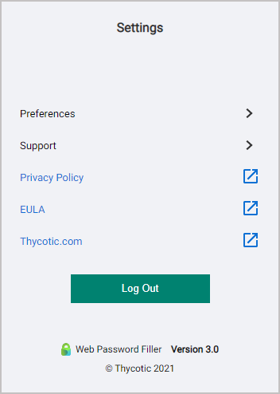
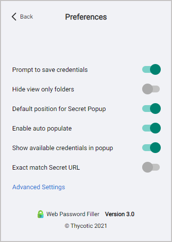

[title]: # (Preferences Menu)
[tags]: # (WPF)
[priority]: # (6)

# Preferences Menu

When you are already logged into Web Password Filler, click the WPF icon. The **Settings** screen appears.

Click **Preferences**. The Preferences screen appears.

* __Prompt to save credentials__: Select this preference is you want WPF to prompt you to save your login credentials for future logins. Not recommended for shared systems. The prompt only appears if an existing secret is updated, or if a user enters credentials for a site and no Secret was used.

* __Hide view only folders__: Select this preference to prevent users from seeing folders to which they have read access only.

* __Show available credentials in popup__: Select this preference to have available credentials will be displayed in a pop-up dialog.

* **Default position for Secret Popup**: Select this preference to have the Secret popup appear at the top right of the screen. The non-default position is under the thycotic check symbol.

* **Enable auto populate**: Select this preference so that when a Secret is available for a web page, WPF will automatically populate the fields on the page.

* **Exact match Secret URL Exact match**. Select this preference to ensure that WPF populates fields only if the URL exactly matches the URL specified in the Secret, and will not populate fields on variations of the URL, including sub-pages.

* **Advanced Settings /> Session Recording Limit** Select this preference to enable setting session recording limits through the UI in hourly increments, from one to eight hours. The default limit is two hours.
