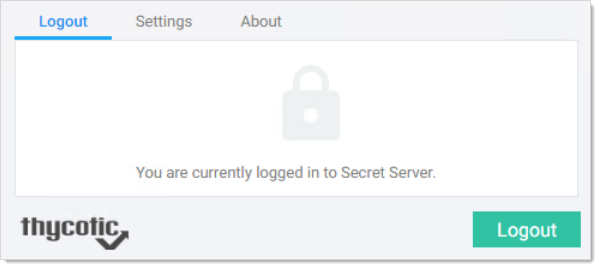

[title]: # (Logging off Secret Server)
[tags]: # (WPF)
[priority]: # (50)

# Logging off Secret Server

Use the WPF icon to logout:

1. On the upper-right of the browser, click the WPFicon. The WPF logout window appears.

   

1. Click the **Logout** button. The WPF icon changes to 
