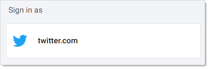
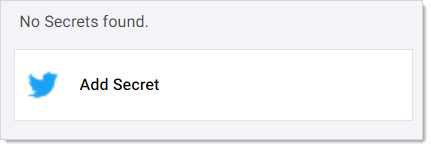

[title]: # (Logging on a Website)
[tags]: # (WPF)
[priority]: # (60)

# Logging on a Website

Once WPF is set up and you are logged into SS, logging into the website is very easy:

1. Take a quick look at your WPF button on your browser’s button bar. If it is grayed out, you will need to log on SS and return here.

1. Navigate to the website you want to access. Note there is a green Thycotic logo in the site’s account name text box:

   

   > **Note:** If you are logged on WPF and do not see the green check in the username text box, please try refreshing the web page to make it appear.

1. Click the Thycotic logo. A WPF popup opens and one of two things can happen:

   - If you have one or multiple existing secrets for a site, a popup will open displaying all of the available secrets to select from. For instance:

   

   - If you have no secrets related to the site, then a popup will open to give you the option to add a new secret:

   

   If you see the second possibility, you need to set up a secret for that website. See [Creating a Secret for a Website](#Creating-a-Secret-for-a-Website).

1. Click the button for the desired secret, and you are logged on.
