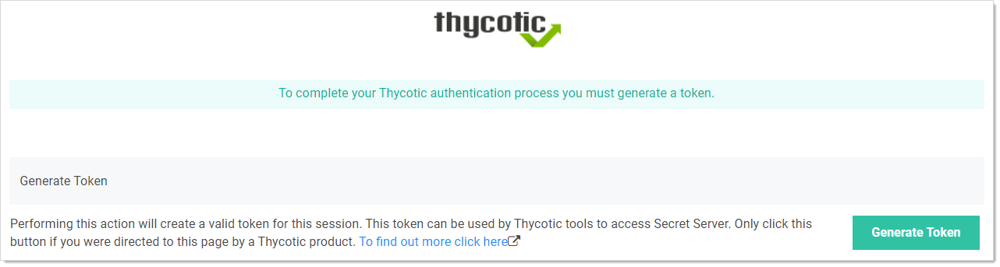

[title]: # (Logging on Secret Server)
[tags]: # (WPF)
[priority]: # (70)

# Logging on Secret Server

Before you have access to any secrets that apply to your websites, you must first log on WPF to connect back to SS. There are two ways to do this. The first is by entering your credentials into WPF and having it verify back with SS. The second is by redirecting the log on (through a new browser tab) back to SS and using the SS Web login to make the connection.

## Manually Logging on Secret Server with WPF

To use the **Password Filler** icon of WPF to log on SS:

> **Note:** Before logging in, ensure that WPF is configured with SS. If you do not have the SS instance in the Configuration tab, WPF prompts you to enter it and switches to that tab before trying to log on. This ensures you know what you are logging into.

1. Open **Google Chrome**.

1. On the upper-right of the browser, click the **Password Filler**  icon. The WPF login window appears:

   

1. In the **Username** text box, type the username you use to access SS. This is your SS user name and not your email address.

1. In the **Password** text box, type the password.

    > **Note:** These are the same credentials you use for logging on SS.

1. Click the **Login** button. If you do not have two-factor authentication enabled in SS, you are now logged on.

1. If you have two-factor authentication enabled in SS (and your log on was authenticated), you are sent to the Two Factor tab to complete the second authentication:

   

1. Depending on how SS is configured, do one of the following:

   - Click the **Push Duo** button to authenticate with your Duo app.
   - Click the **Phone** button to receive an authentication text message with a PIN code. Type that code in the **Pin Code** text box.

1. Click the **Login** button. You are now logged on SS, and the WPF icon changes to

## Logging on Secret Server with the WPF Secret Server Button

The “Login with Secret Server” button allows you to log on WPF using a redirect through the SS log on. This replaces the User Name and Password text boxes on the Login tab in WPF.

> **Note:** If this is your first time using it, see [Enabling the Secret Server Button in WPF](#Enabling-the-Secret-Server-Button-in-WPF) first.

1. Open **Google Chrome**.

1. On the upper-right of the browser, click the **Password Filler**  icon. The WPF login window appears:

   

   If you already have enabled the “Use Secret Server to login” option on the Settings tab, then the Login tab will show the “Login with Secret Server” button

1. Click the **Login with Secret Server** button. WPF opens a new tab for SS in the browser, where you can log on.

   > **Note:** After logging on SS, or if you were recently logged on, then the following “Generate token” page should appear in your browser. Click the “Generate Token” button.
   >
   > 
   > You will then be logged on, and the browser tab with SS will automatically close.

1. If you have two-factor authentication enabled in SS (and your log on was authenticated), you are sent to the Two Factor tab to complete the second authentication:

   

1. Depending on how SS is configured, do one of the following:

   - Click the **Push Duo** button to authenticate with your Duo app.
   - Click the **Phone** button to receive an authentication text message with a PIN code. Type that code in the **Pin Code** text box.

1. Click the **Login** button. You are now logged on SS, and the WPF icon changes to
