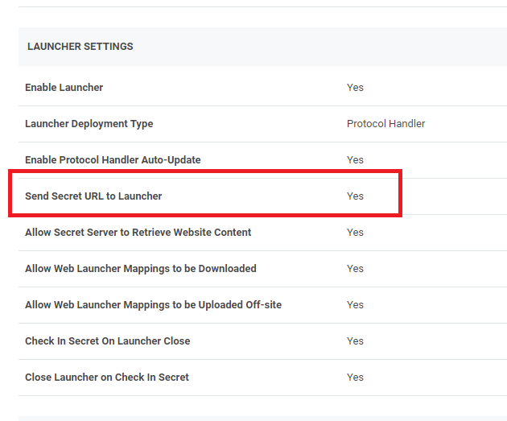

[title]: # (2.0.2 Release Notes)
[tags]: # (web password filler)
[priority]: # (39993)
# 2.0.2 Release Notes

## Enhancements

* Added a Secret Server-side check to determine if launching a Secret from Secret Server should always use the URL from the Secret or the value from an internal Secret Server table (requires Secret Server release version 10.9). To enable this, refer to Secret Server Configuration information.

  
* Added Windows Admin Center support. Refer to [Windows Admin Center](../using-wpf/win-admin-ctr.md) topic for details.
* Added an additional check on user name related fields (like User name, phone number and email) to see if they have a "searchable" attribute and will no longer populate the Thycotic check logo in the field.

## Bug Fixes

* Resolved an issue when a website used multi-page logins or page redirect during while launching a web password secret from Secret Server, resulting in Secret Server sending a different URL to Web Password Filler. This is resolved by the above Secret Server-side check and setting the launcher option in Secret Server.
* Resolved an issue that prevented the password from being filled for logins on sites:
  * www.businessdirect.att.com
  * login.tenable.com
* Resolved an issue where Secret Server instances that use Windows Authentication caused Web Password filler to prompt users to generate a new login token (for a second time) even if they had already generated a token.
* Resolved an issue where logging into a Microsoft Online account with a username that is in all capital letters results in the password field being cleared (by the site) when it redirects to the password page.
* Resolved an issue for browser tabs being closed when multiple Secrets (with session recording) are launched in the same browser for the same IP address (but with different port numbers). Resolution does require an additional IP address:port value pair to be added to the RegEx field in Secret Server.
* Resolved issue for a site where the auto-fill values from the secret were being entered into the fields and then cleared out by the site.

## Known Issues

* If you have multiple identity providers and attempt to log in multiple times (for example, open WPF and click login, then open WPF again and click login a second time) an error is triggered after clicking the login button the second time, and one of the following messages can appear:
  * Secret Server displays an error that the authenticity of the page could not be verified.

    
  * WPF shows an error on those pages that were not used to log in

    

  This is expected behavior. The first log in will be successful and the user will be logged into WPF. There is no reason to have the additional tabs open and the user can simply close the additional tabs.
* If WPF Secret Server configuration has two back slashes at the end of the URL, the generated token does not appear to work. Resolution, remove one of the back slashes:
  * incorrect ->  `https://mysecretServer//`
  * correct -> `https://mysecretServer/` OR `https://mysecretServer`
