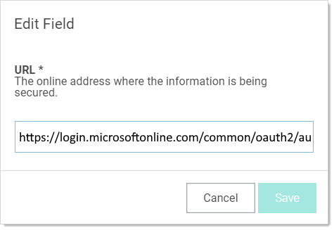

[title]: # (Using Web Password Filler with Microsoft Online Services)
[tags]: # (WPF)
[priority]: # (80)

# Using Web Password Filler with Microsoft Online Services

This section guides users through using the Web browser extension to use SS WPF to log on Microsoft Online. Launching Microsoft Online secrets with WPF takes a bit of extra configuration. This section explains the issue and suggests remedies.

> **Note:** This version of WPF is available in SS release 10.7.59 and later.

> **Note:** These instructions assume you have WPF installed correctly and are connected to SS. If Microsoft Online is your first site using WPF, we suggest first testing your installation on another site.

## The Problem

When you try to open a Microsoft Online secret with WPF, you might see

or

Neither of these errors provide a useful explanation. The real issue is simple with a very easy solution that you can implement yourself.

## What Is Going on?

Normally, WPF captures the URL of the website you are on when it creates a secret, storing the URL (and other data), for logging on that website. This is very convenient and usually works great. Unfortunately, with Microsoft Online, when you try to log on with that secret, you get an error because the log on URL initially stored in the secret is for a redirected page that is no longer valid. Fortunately, WPF uses the URL stored in the secret, so once you adjust that URL, you never have to do it again.

The original (errant) stored URL is:

`https://login.microsoftonline.com/common/oauth2/authorize`

The permanent (real) URL is:

 `https://login.microsoftonline.com`

So all that is needed is to ensure the secret stores the permanent URL, not the origin one.

There are two ways to do this:

- **Before Saving the WPF Secret:** Change the URL when it is initially stored, right from WPF, *before* the secret is saved. This method is available if you create a new WPF secret using the WPF Add Secret button or the browser’s context (right click) menu.
- **After Saving the WPF Secret:** Change the URL after the WPF secret is stored in SS. This method is the only option if the WPF secret has already been saved in SS with the one-time redirected URL. This could happen because the WPF secret was created by an earlier WPF version or because you created the secret using the automatic secret creation feature, which captured the one-time redirected URL rather than the permanent one.

## Fixing the Issue When Creating the WPF Secret

> **Important:** Read this *entire* instruction before starting it.

If you have not yet created the secret, follow this method:

1. Go to the Microsoft Online log on (you already have an account and log on) or log-on setup page (you are setting up a new log on).

1. Follow the [Creating a Secret for a Website](#Creating-a Secret-for-a-Website) procedure. 

1. When you get to the *second* “Add Account to Secret Server” popup, which looks like this:

   

   You now see the website URL that WPF inferred, which is incorrect. The secret name was inferred too—leave it as is or change it to whatever you like.

1.  Delete all the text after .com in the **URL** text box. Your URL should look like this:

     `https://login.microsoftonline.com`

1.  Return to and complete the rest of the instructions for the [Creating a Secret for a Website](#Creating-a Secret-for-a-Website) procedure.

## Fixing the Issue After Having Saved the WPF Secret

1. Log on SS.

1. Navigate to the WPF secret for that Microsoft Online site. It is most likely named **login.microsoftonline.com**, which is the inferred name from WPF. See [Searching Secrets](#searching-secrets) if you do no know where to find it.

1. On the **General** tab for the secret, click the **Edit** link next to the **URL** text box:

   

1. Delete all the text after .com in the **URL** text box. Your URL should look like this:

   `https://login.microsoftonline.com`

1. Click the **Save** button.

1. Log out of SS.

1. Return to Microsoft Online to test the secret. You will need to log on again.
