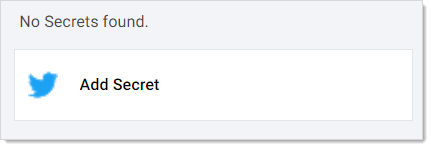
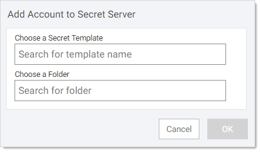
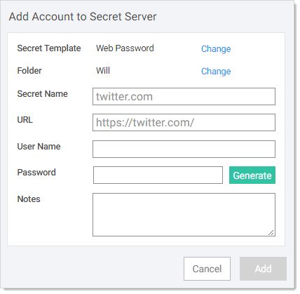

[title]: # (Creating a Secret for a Website)
[tags]: # (WPF)
[priority]: # (4)

# Creating a Secret for a Website

1. Navigate to the __create a new account__ form on the website you want to create a secret for.
1. Click the Thycotic icon in the password text box. A modal appears:

   

   You can also select the username or password fields and right-click and go to __Password Filler | Add Secret__.
1. Click the __Add Secret__ button. The __Add Account to Secret Server__ modal appears:

   
1. Begin typing "web" in the __Choose a Secret Template__ search box. The word Web Password will appear in a dropdown list. By default, WPF tries to add the standard Web Password template for you. You can search for a different template.
1. Click the __Web Password__ suggestion. The search box is populated with it.
1. Type the name of the Secret Server folder in which you want the secret to reside. If you did not already set one up, by default, Secret Server creates a folder titled with your Secret Server username. Click to select the desired folder in the drop-down that appears. By default, WPF tries to select the personal folder for the username that you used for the login. If one does not exist, you will need to specify which folder to save it to.
1. Click __OK__. Another __Add Account to Secret Server__ modal appears:

   

   Secret Server fills in some of the text boxes for you based on the current website.

   If you are setting up a secret for Microsoft Online, leave the modal as is (do not close it) and read [Using WPF with Microsoft Online Services](mos.md) before continuing.
   1. The __Secret Name__ text box is pre-filled by WPF, you may customize to a sensible name that identifies the secret well in a multi-user environment.
   1. Type your username for the website for __User Name__.
   1. If this is a new account, click __Generate__ to create a strong password for the site. Otherwise, use the existing password for the website.
   1. Click __Add__. WPF will populate the "new account" based on the entered information. The Add Account Secret Server modal disappears. A secret is now available for the password and name on the website's main login page.

   >**Note**: Not all websites work with WPF populating the "new account" information for you. There are ways around that, like creating the website account first outside of WPF, and then using those credentials.
