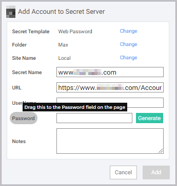
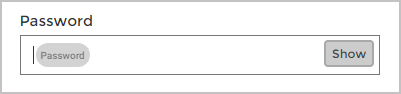

corresponding[title]: # (Mapping Login Fields)
[tags]: # (WPF)
[priority]: # (4)

# Mapping Login Fields

Some websites use unconventional labels to internally identify their username, password, and other login fields, and the Web Password Filler cannot automatically identify these fields. Users can map the fields on the Web page to the fields in the Secret using drag-and-drop functionality. To enable the field mapping function in the Web Password Filler, an administrator must add a new metadata section in Secret Server named WPFHints.

## Map fields on a Web page form to the fields in a Secret

1. While creating a new Secret for a website, hover your cursor over the field you want to map in the Secret. The field is highlighted in a gray oval, with instructions to drag the field to the corresponding field on the web page.

   

1. Drop the field into the field on the web page form that you want to map.

   
