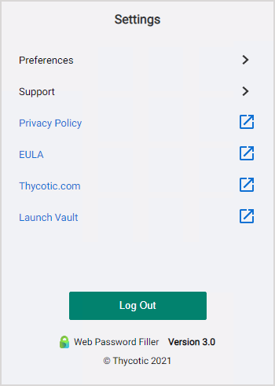

[title]: # (Logout)
[tags]: # (WPF)
[priority]: # (20)
# Logout of Secret Server

Use the WPF icon to logout:

1. On the upper-right of the browser, click the WPF icon:

   
1. The WPF logout modal opens.

   

   Click __Logout__.
1. The WPF icon changes to:

   
