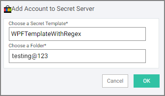
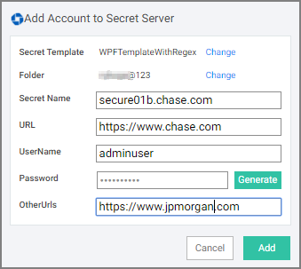
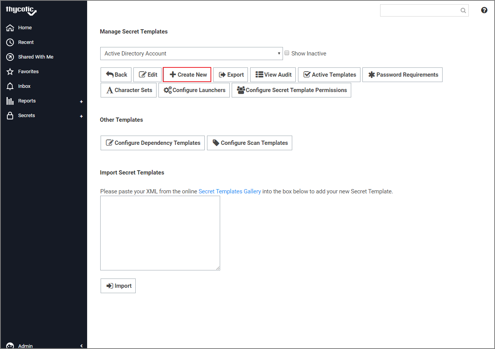
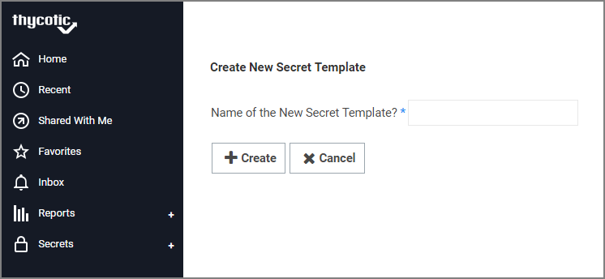
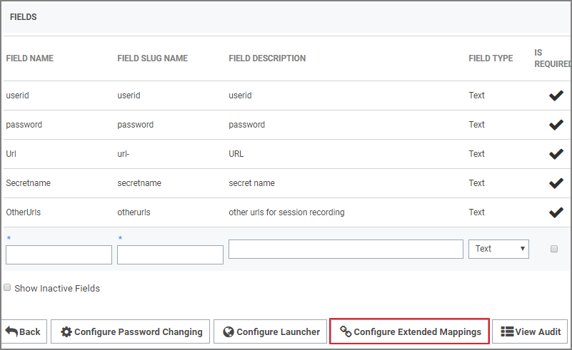
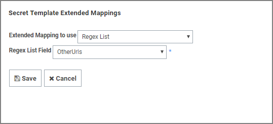

[title]: # (Session Recording)
[tags]: # (WPF)
[priority]: # (10)
# Session Recording

Session recording for web sessions is supported in the Web Password Filler. In order for a web session to be recorded the Secret (in Secret Server) must have the Session Recording option enabled in the Security settings.

When you launch a Secret that has session recording enabled, or you navigate to a web page and select a Secret that has session recording enable, the recording will start as soon as the credentials are filled into the login fields (Username/Password, etc.).

Once the Session recording starts you should see a notification message pop-up on the upper right-hand side of the browser window indicating that recording has begun, and on sites that allow it, the logo on the tab will alternate between the site logo and the recording icon.

>**Important**: When recording web sessions, the recording will be limited to the exact match for the domain/subdomain for the URL (i.e. everything between `http(s)://` and the next `/`. Anything not included in the exact URL will not be recorded. For example, if a Secret with session recording has the URL value set to `https://thycotic.company.com/` then only browser tabs opened for that URL will be recorded. If the login page then redirects to `https://company.com` then the session is no longer be recorded since the subdomain is now different.

If you want to capture other sites that have a different subdomain that launch from the same Secret, then you need to configure the Secret to include the other URLs using RegEx.

## RegEx

RegEx is a sequence of patterns specified in Secret Server templates and provided to be specified as __OtherUrls__ during account setup in Web Password Filler (WPF), allowing session recording on redirected websites.

When a user is logged into a website using a secret and session recording is enabled, WPF will record a session for that URL. If a user is redirected to another URL and session recording should continue for the redirected URL, those URLs can be added in the __OtherUrls__ field when the account is added. Currently this field supports only URLs.

>**Note**: That as soon as a URL is accessed for a website and secret with session recording enabled, session recording will capture everything the user does, even if the user changes a password for that secret.

## Using RegEx in WPF

1. To add a new secret via WPF, select a Secret Server template that has the RegEx field.

   
1. Click __OK__.
1. In the new Add Account to Secret Server dialog add the required details.

   

   In the field __OtherUrls__,  enter any other URL for which session recording should enabled, in the event that the user is redirected to those URLs.  
1. Click __Add__.

## Setup in Secret Server

1. Sign into Secret Server and navigate to __Admin | Secret Templates__.

   
1. Click __Create New__.
1. Name the new secret and click __Create__.

   
1. On the __Settings__ page, click __Configure Extended Mappings__.

   
1. On the __Secret Template Extended Mappings__ page click __Add New Mapping__.

   

   1. From the __Extended Mapping to use__ drop-down select __Regex List__.
   1. From the __Regex List Field__ drop-down select __OtherUrls__.
   1. Click __Save__.

The template is now ready to be used in WPF.
