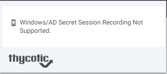

[title]: # (Windows Admin Center)
[tags]: # (troubleshooting)
[priority]: # (29)
# Windows Admin Center Support

Windows Admin Center now supports secrets that contain machine name / IP address combination:

* New user name will default/use a web password template only (Windows and AD templates are not supported)
* Using the “Connect” button in Windows Admin Center, will not show secrets associated with the selected machine
  * Work around:  Select the machine link to retrieve the associated secrets
* Updating passwords will update the password in the current secret regardless of template
* How secrets are returned:
  * Secrets with Host Name (As machine name)
    * link text --> IP (Host Name) --- Secrets will be returned
    * link text --> Host Name --- Secrets will be returned
    * link text --> IP Address --- Secrets will NOT be returned
  * Secrets with IP Address (As machine name)
    * link text --> IP(Host Name) --- Secrets will NOT be returned
    * link text --> Host Name --- Secrets will NOT be returned
    * link text --> IP Address --- Secrets will be returned
* Session Recording of non-web password templates is not allowed. If an attempt to use a secret to log into an RDP session is made and the secret has session recording enabled, WPF will not allow the user to proceed and display the following message.  

  
